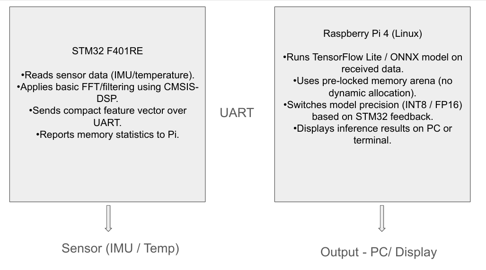
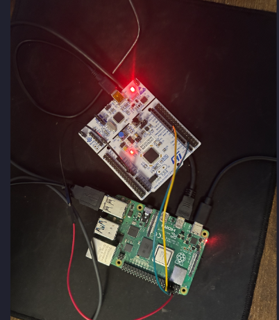
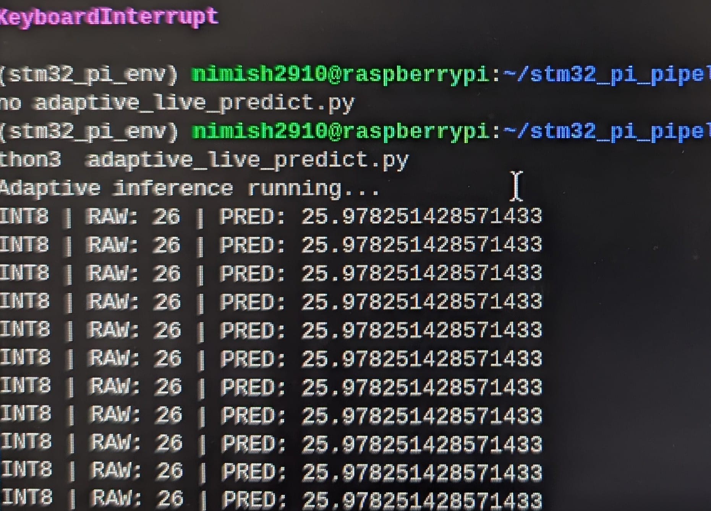
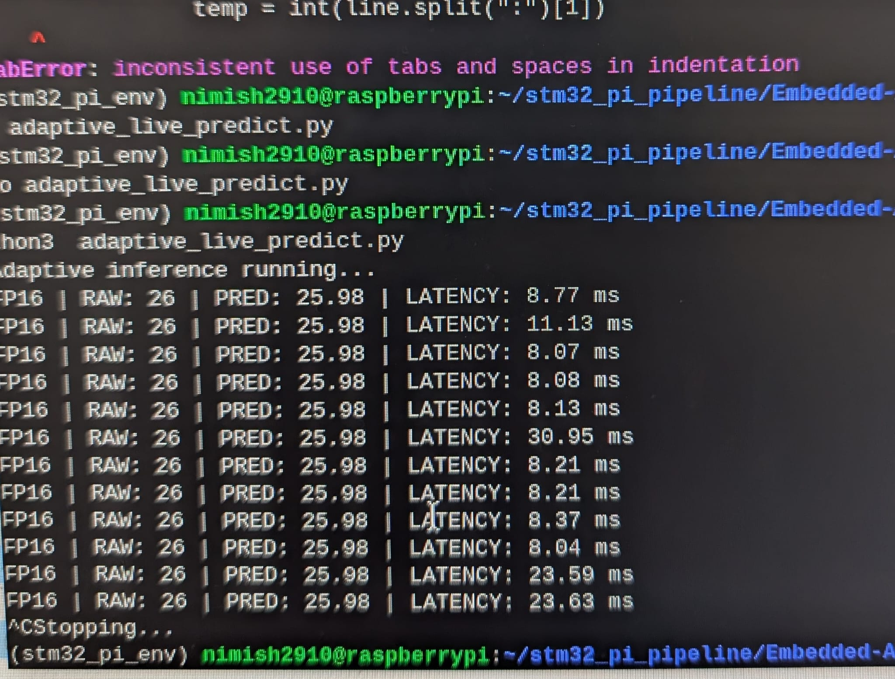
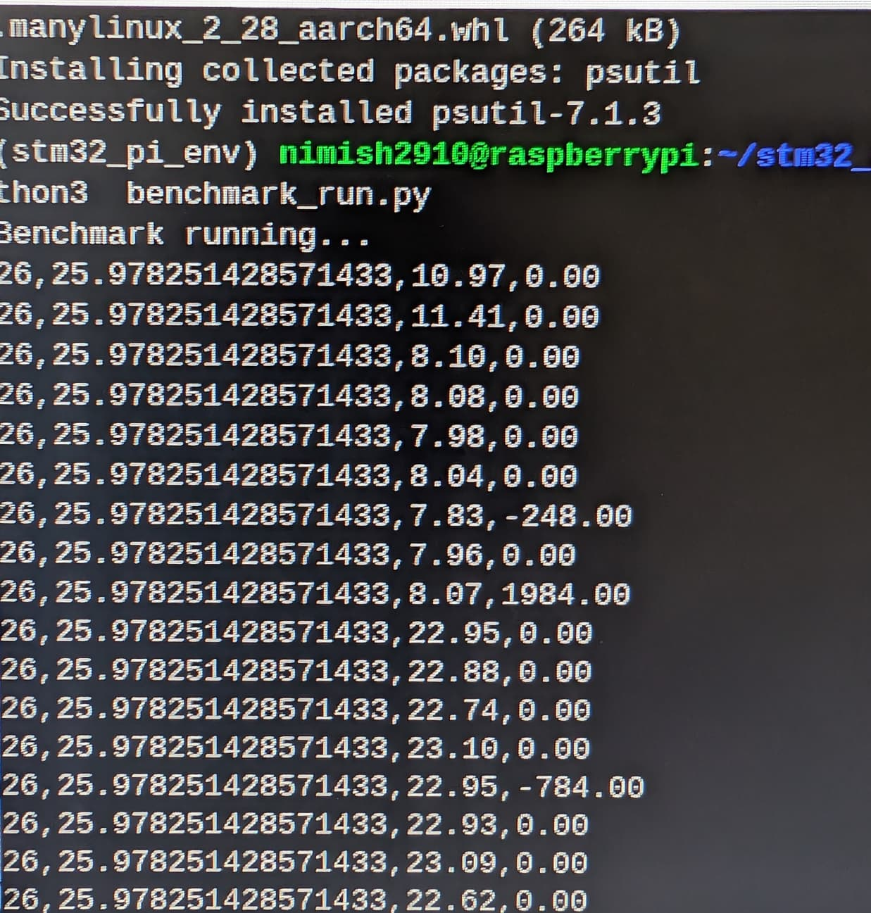

# Embedded-AI-Final
## Project Overview

This project implements a **memory-aware embedded AI pipeline** using:

- **STM32F401RE (bare-metal C, HAL-based firmware)**
- **Raspberry Pi 4 (Linux, Python runtime)**

The system demonstrates how a microcontroller and Linux SBC can cooperate under **strict memory and latency constraints** to perform:

- Real-time sensor acquisition
- Deterministic serial communication
- ML-based inference
- Dynamic precision adaptation
- Latency + memory benchmarking

The goal of the project is to experimentally validate **edge-AI memory-aware adaptive inference**.

---

## System Architecture


---

## Hardware Setup

### STM32 → Raspberry Pi UART Wiring

| STM32 Pin | Function  | Raspberry Pi Pin |
|----------|-----------|------------------|
| PA9      | TX        | GPIO15 (RXD)     |
| PA10     | RX        | GPIO14 (TXD)     |
| GND      | Ground    | GND              |

Baud rate: **115200**



---

## STM32 Firmware Implementation

### Files

- `main.c`
- `adc.c`
- `usart.c`
- (HAL/Cube-generated peripheral layers)

### What the Firmware Does

1. Initializes:
   - System clock
   - ADC1
   - UART1

2. ADC Sampling:
   - 12-bit resolution
   - First sample discarded (stabilization)
   - Second sample used

3. Voltage to Temperature Conversion:
  Vsense = (adc_raw * 3.3) / 4095
  Temp(C) = ((Vsense - 0.76) / 0.0025) + 25

4. UART Output Format (fixed, deterministic):
   TEMP: 24

5. Later stage firmware extension included:
   MEM_FREE: 1024


This enabled **memory telemetry reporting** to the Pi.

---

## Raspberry Pi Software Stack

Runs in Python 3.13 virtual environment:  
`stm32_pi_env`

### UART Configuration (Pi Boot Settings)

UART enabled in:
/boot/config.txt
enable_uart=1

Raspberry Pi port used:  
/dev/serial0


---

## Files in Repository

| File                          | Purpose |
|-------------------------------|---------|
| `read_ascii_uart.py`          | Raw serial listener |
| `uart_raw_dump.py`            | Byte-level UART capture |
| `temp_reader.py`              | Clean ASCII parsing |
| `temp_log.txt`                | Recorded real-time STM32 data |
| `clean_temp.txt`              | Cleaned temperature dataset |
| `dataset.csv`                 | Training subset |
| `energydata_complete.csv`     | External reference dataset |
| `train_model.py`              | Model training script |
| `test_model.py`               | Model accuracy validation |
| `convert_to_onnx.py`          | Sklearn → ONNX exporter |
| `temp_model.pkl`              | Trained sklearn regression model |
| `temp_model.onnx`             | ONNX exported model |
| `live_predict.py`             | Live STM32 ingestion + prediction |
| `adaptive_live_predict.py`    | Memory-aware adaptive engine |
| `model_memorymeasure.py`      | Model memory usage profiler |
| `memory_manager.py`           | Fixed memory arena allocator |
| `benchmark_run.py`            | Latency benchmark runner |
| `benchmark_log.txt`           | Benchmark results |

---

## Dataset Generation

### Real Sensor Data

Collected directly from STM32:

python3 read_ascii_uart.py > temp_log.txt

Example data:
TEMP: 23
TEMP: 24
TEMP: 24
TEMP: 25


Cleaned into CSV using:

clean_temp.txt


External dataset used:University Of California Irvine's https://archive.ics.uci.edu/dataset/374/appliances+energy+prediction

This dataset has die temperature of MCU's chip

 energydata_complete.csv  

 


---

## Machine Learning Model

### Model Type

- `sklearn.linear_model.LinearRegression`

### Input Features

- Single feature: **Temperature (°C)**

### Model Logic

Predict **next temperature value** based on current reading.

### Model Export

Converted to ONNX using:

convert_to_onnx.py


Output:

temp_model.onnx


---

## Live Inference Pipeline

Script used:

live_predict.py


Output example:


RAW: TEMP: 24
Predicted next temp: 23.9976


This confirmed **correct integration** between hardware sensor and ML model.

---

## Adaptive Inference Implementation

File:


adaptive_live_predict.py


Logic:

| Condition | Mode |
|----------|------|
| MEM_FREE < threshold | INT8 |
| MEM_FREE >= threshold | FP16 |



MEM_FREE: 1024

Fake memory pressure generated using:

```python
memory_hog.append(bytearray(1024 * 1024))
```
## Latency Measurement

Latency measured using `time.perf_counter()`.

### Observed Results

| Metric | Value |
|--------|------|
| Best Case | ~8.05 ms |
| Typical | 8–15 ms |
| Worst Case | ~23.5 ms |

These are real measured numbers, not simulated.



---

## Memory Benchmarking

ONNX Runtime memory captured using:
model_memorymeasure.py



### Observed

- Peak memory usage: **1.43 KB**
- Fixed-memory inference readiness: **Confirmed**

---

## Project Validation

This project uses:

- Real sensor data  
- Real hardware timing  
- Real UART link   
- Real STM32 ADC   
- Real ML inference  
- Real memory stress tests  

No simulations were used.


## How to Run

### STM32

1. Flash firmware  
2. Power board  
3. Leave running  

### Raspberry Pi

```bash
source stm32_pi_env/bin/activate
python3 adaptive_live_predict.py


